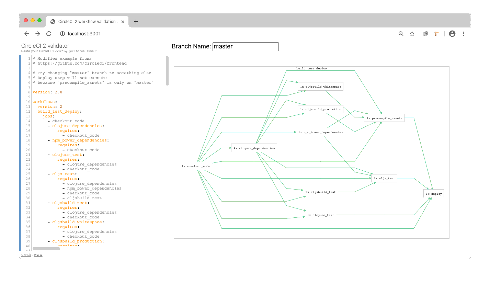

# CircleCI 2 visualisation

## [https://js-rocket.github.io/circleci-workflow-validator/](https://js-rocket.github.io/circleci-workflow-validator/)

For anybody who is struggling managing a complex CircleCI 2 config. And anybody who needs to migrate to CircleCI 2 _this week_!
See Circle CI workflows and preview them in different branches.

This fork adds support for approval step in workflow and also includes a minor UI fix

